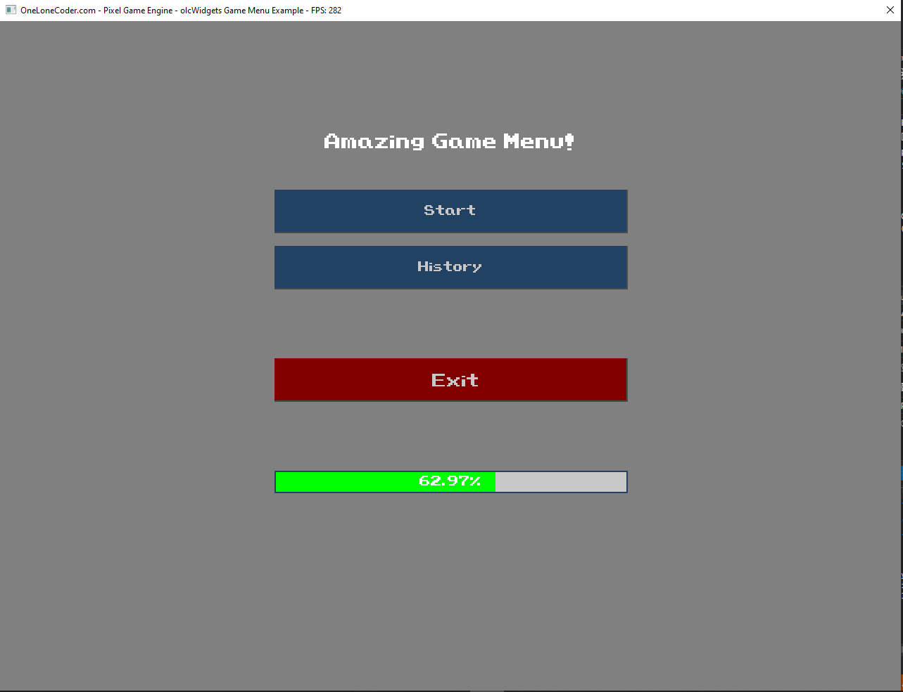

# olcWidgets
Some basic UI Widgets for the olc::PixelGameEngine

# Supported Widgets 
- Label
- Button
- SpriteButton
- DropDownList
- ProgressBar

# Examples

## Features and bugs
If you face any problems feel free to open an issue at the [issue tracker][tracker]. If you feel the extension is missing a feature, please raise a ticket on Github. Pull request are also welcome.

[tracker]: https://github.com/BaderEddineOuaich/olcWidgets/issues

